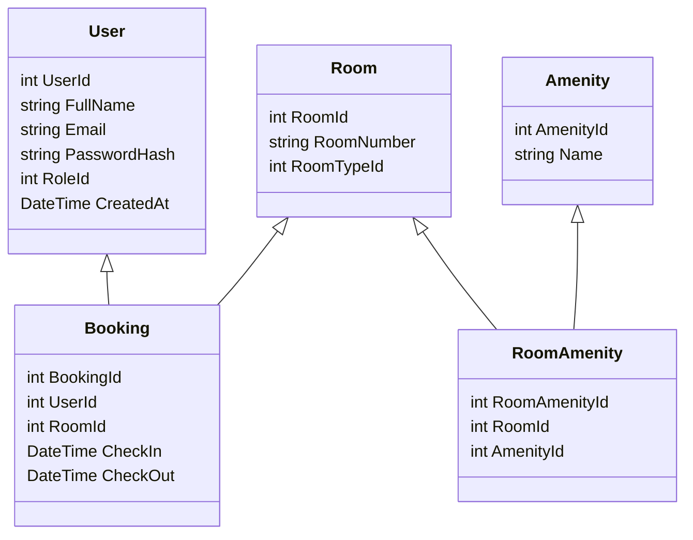

# Architecture Schema for Hotel Management System Backend

## Entity Relationships

Below is a simplified schema for core entities and their relationships:

## Table Structures

### User
- **UserId** (int, PK)
- **FullName** (string)
- **Email** (string, unique)
- **PasswordHash** (string)
- **RoleId** (int, FK to Role)
- **CreatedAt** (DateTime)

### Booking
- **BookingId** (int, PK)
- **UserId** (int, FK to User)
- **RoomId** (int, FK to Room)
- **CheckIn** (DateTime)
- **CheckOut** (DateTime)
- **Status** (string/enum)

### Room
- **RoomId** (int, PK)
- **RoomNumber** (string)
- **RoomTypeId** (int, FK to RoomType)
- **Status** (string/enum)

### Amenity
- **AmenityId** (int, PK)
- **Name** (string)
- **Description** (string, optional)

### RoomAmenity (Junction Table)
- **RoomAmenityId** (int, PK)
- **RoomId** (int, FK to Room)
- **AmenityId** (int, FK to Amenity)

## Relationship Notes
- **User to Booking:** One-to-Many (A user can have multiple bookings)
- **Room to Booking:** One-to-Many (A room can have multiple bookings)
- **Room to RoomAmenity:** One-to-Many
- **Amenity to RoomAmenity:** One-to-Many
- **Many-to-Many:** Room and Amenity via RoomAmenity

## Additional Entities (if applicable)
- **Role:** User roles (e.g., Admin, Customer)
- **RoomType:** Types of rooms (e.g., Single, Double)
- **Payment:** Linked to Booking for transactions

---
This schema represents the core data model. Use EF Core migrations to manage changes.
