# ChatBot System - Class Diagram

## PlantUML Class Diagram

```plantuml
@startuml ChatBot_Class_Diagram

' ============================================
' CONTROLLERS
' ============================================
package "Controllers" {
    class ChatBotController {
        - _chatService: IChatService
        - _historyService: IChatHistoryService
        - _logger: ILogger<ChatBotController>
        + SendMessage(request: ChatRequest): Task<IActionResult>
        + GetHistory(sessionId: Guid): Task<IActionResult>
        + ClearSession(sessionId: Guid): Task<IActionResult>
        + HealthCheck(): IActionResult
        + GetSessionsByAccount(accountId: int, limit: int): Task<IActionResult>
    }
}

' ============================================
' SERVICES
' ============================================
package "Services" {
    interface IChatService {
        + SendMessageAsync(request: ChatRequest): Task<ResultModel>
        + GetChatHistoryAsync(sessionId: Guid): Task<ResultModel>
        + ClearSessionAsync(sessionId: Guid): Task<ResultModel>
    }
    
    class ChatService {
        - _historyService: IChatHistoryService
        - _keyManager: IGeminiKeyManager
        - _bookingPlugin: HotelBookingPlugin
        - _logger: ILogger<ChatService>
        + SendMessageAsync(request: ChatRequest): Task<ResultModel>
        + GetChatHistoryAsync(sessionId: Guid): Task<ResultModel>
        + ClearSessionAsync(sessionId: Guid): Task<ResultModel>
        - HandleRetryLogic(maxRetries: int): Task<ResultModel>
        - BuildSemanticKernel(apiKey: string): Kernel
    }
    
    interface IChatHistoryService {
        + GetOrCreateSessionAsync(sessionId: Guid?, accountId: int?, guestIdentifier: string?): Task<ChatSession>
        + GetSmartHistoryAsync(sessionId: Guid, kernel: Kernel): Task<ChatHistory>
        + AddMessageAsync(sessionId: Guid, role: string, content: string, metadata: string?): Task
        + GetSessionMessagesAsync(sessionId: Guid, limit: int): Task<List<ChatMessageDto>>
        + GetSessionsByAccountAsync(accountId: int, limit: int): Task<List<ChatSessionDto>>
        + CleanupOldSessionsAsync(daysOld: int): Task
    }
    
    class ChatHistoryService {
        - _context: HotelManagementContext
        - _keyManager: IGeminiKeyManager
        - _frontendSettings: FrontendSettings
        - _logger: ILogger<ChatHistoryService>
        + GetOrCreateSessionAsync(...): Task<ChatSession>
        + GetSmartHistoryAsync(sessionId: Guid, kernel: Kernel): Task<ChatHistory>
        + AddMessageAsync(...): Task
        + GetSessionMessagesAsync(sessionId: Guid, limit: int): Task<List<ChatMessageDto>>
        + GetSessionsByAccountAsync(accountId: int, limit: int): Task<List<ChatSessionDto>>
        + CleanupOldSessionsAsync(daysOld: int): Task
        - BuildSystemPrompt(): string
        - SummarizeOldMessages(messages: List<ChatMessage>, kernel: Kernel): Task<string>
    }
    
    interface IGeminiKeyManager {
        + GetAvailableKey(): string
        + MarkKeyAsExhausted(apiKey: string): void
        + GetAvailableKeyCount(): int
        + GetSettings(): GeminiSettings
    }
    
    class GeminiKeyManager {
        - _settings: GeminiSettings
        - _blacklistedKeys: HashSet<string>
        - _keyRotationIndex: int
        + GetAvailableKey(): string
        + MarkKeyAsExhausted(apiKey: string): void
        + GetAvailableKeyCount(): int
        + GetSettings(): GeminiSettings
        - RotateToNextKey(): string
    }
}

' ============================================
' PLUGINS (Semantic Kernel Functions)
' ============================================
package "Plugins" {
    class HotelBookingPlugin {
        - _unitOfWork: IUnitOfWork
        - _context: HotelManagementContext
        - _logger: ILogger<HotelBookingPlugin>
        + {kernel function} search_available_rooms(checkIn: string, checkOut: string, guests: int): Task<string>
        + {kernel function} get_room_details(roomTypeId: int): Task<string>
        + {kernel function} get_current_date(): string
        + {kernel function} search_room_type_statistics(statisticType: string, maxPrice: decimal?, minOccupancy: int?): Task<string>
        - ParseDate(dateString: string): DateTime?
        - FormatRoomSearchResults(rooms: List<RoomType>): string
    }
}

' ============================================
' MODELS (Database Entities)
' ============================================
package "Models" {
    class ChatSession {
        + SessionId: Guid <<PK>>
        + AccountId: int? <<FK>>
        + GuestIdentifier: string?
        + CreatedAt: DateTime
        + LastActivityAt: DateTime?
        + IsSummarized: bool
        + ConversationSummary: string?
        + IsActive: bool
        --
        + Account: Account?
        + ChatMessages: ICollection<ChatMessage>
    }
    
    class ChatMessage {
        + MessageId: Guid <<PK>>
        + SessionId: Guid <<FK>>
        + Role: string
        + Content: string
        + CreatedAt: DateTime
        + Metadata: string?
        + TokenCount: int?
        --
        + ChatSession: ChatSession
    }
    
    class Account {
        + AccountId: int <<PK>>
        + Username: string
        + Email: string
        + PasswordHash: string
        + IsLocked: bool
        + CreatedAt: DateTime
        --
        + ChatSessions: ICollection<ChatSession>
    }
}

' ============================================
' DTOs (Data Transfer Objects)
' ============================================
package "DTOs" {
    class ChatRequest {
        + Message: string
        + SessionId: Guid?
        + AccountId: int?
        + GuestIdentifier: string?
    }
    
    class ChatResponse {
        + SessionId: Guid
        + Message: string
        + IsNewSession: bool
        + Timestamp: DateTime
        + Metadata: Dictionary<string, object>?
    }
    
    class ChatMessageDto {
        + MessageId: Guid
        + Role: string
        + Content: string
        + CreatedAt: DateTime
        + Metadata: string?
    }
    
    class ChatSessionDto {
        + SessionId: Guid
        + LastActivityAt: DateTime?
        + MessageCount: int
        + IsActive: bool
        + Preview: string?
    }
}

' ============================================
' EXTERNAL LIBRARIES
' ============================================
package "Microsoft.SemanticKernel" <<External>> {
    class Kernel {
        + Plugins: KernelPluginCollection
        + GetRequiredService<T>(): T
    }
    
    class ChatHistory {
        + AddSystemMessage(content: string)
        + AddUserMessage(content: string)
        + AddAssistantMessage(content: string)
        + Count: int
    }
    
    interface IChatCompletionService {
        + GetChatMessageContentAsync(chatHistory: ChatHistory, settings: PromptExecutionSettings, kernel: Kernel): Task<ChatMessageContent>
    }
}

package "Microsoft.SemanticKernel.Connectors.Google" <<External>> {
    class GeminiPromptExecutionSettings {
        + MaxTokens: int
        + Temperature: double
        + ToolCallBehavior: GeminiToolCallBehavior
    }
}

' ============================================
' RELATIONSHIPS
' ============================================

' Controller -> Service
ChatBotController ..> IChatService : uses
ChatBotController ..> IChatHistoryService : uses

' Service implementations
IChatService <|.. ChatService : implements
IChatHistoryService <|.. ChatHistoryService : implements
IGeminiKeyManager <|.. GeminiKeyManager : implements

' Service dependencies
ChatService ..> IChatHistoryService : uses
ChatService ..> IGeminiKeyManager : uses
ChatService ..> HotelBookingPlugin : uses
ChatService ..> Kernel : uses
ChatService ..> IChatCompletionService : uses

ChatHistoryService ..> HotelManagementContext : uses
ChatHistoryService ..> ChatSession : manages
ChatHistoryService ..> ChatMessage : manages
ChatHistoryService ..> Kernel : uses
ChatHistoryService ..> ChatHistory : builds

HotelBookingPlugin ..> HotelManagementContext : queries

' DTOs
ChatBotController ..> ChatRequest : receives
ChatBotController ..> ChatResponse : returns
ChatService ..> ChatRequest : processes
ChatService ..> ChatResponse : creates
ChatHistoryService ..> ChatMessageDto : returns
ChatHistoryService ..> ChatSessionDto : returns

' Entity relationships
ChatSession "1" --> "*" ChatMessage : contains
ChatSession "*" --> "0..1" Account : belongs to

' External library usage
ChatService ..> GeminiPromptExecutionSettings : configures
Kernel ..> HotelBookingPlugin : registers

@enduml
```

## Component Description

### 1. **Controllers Layer**
- **ChatBotController**: REST API endpoints cho chatbot
  - POST `/api/chatbot/message`: Gửi tin nhắn
  - GET `/api/chatbot/history/{sessionId}`: Lấy lịch sử chat
  - DELETE `/api/chatbot/session/{sessionId}`: Xóa session
  - GET `/api/chatbot/health`: Health check
  - GET `/api/chatbot/account/{accountId}`: Lấy sessions theo user

### 2. **Services Layer**

#### **ChatService**
- Xử lý logic chính của chatbot
- Tích hợp với Google Gemini AI
- Retry logic khi API key bị rate limit (429)
- Auto-invoke kernel functions (tool calling)

#### **ChatHistoryService**
- Quản lý sessions và messages
- Smart history loading với summarization
- Support cả authenticated users và guests
- Auto-cleanup old sessions

#### **GeminiKeyManager**
- Quản lý multiple API keys
- Key rotation khi gặp rate limit
- Blacklist keys đã hết quota

### 3. **Plugins Layer**
- **HotelBookingPlugin**: Semantic Kernel functions cho chatbot
  - `search_available_rooms`: Tìm phòng trống
  - `get_room_details`: Lấy chi tiết phòng
  - `get_current_date`: Lấy ngày hiện tại
  - `search_room_type_statistics`: Thống kê loại phòng

### 4. **Models Layer**
- **ChatSession**: Lưu thông tin phiên chat (user/guest)
- **ChatMessage**: Lưu tin nhắn (role: user/assistant)
- **Account**: Link chat session với user account

### 5. **DTOs Layer**
- **ChatRequest**: Input từ client
- **ChatResponse**: Output trả về client
- **ChatMessageDto/ChatSessionDto**: DTOs cho API responses

## Key Features

### 🔄 **Auto Retry với Multiple API Keys**
- Khi API key bị rate limit (429) → tự động chuyển sang key khác
- Exponential backoff: 3s, 6s, 9s
- Blacklist keys đã hết quota

### 🧠 **Smart History Management**
- Summarization khi history quá dài (> threshold)
- Keep last N messages + summary of old messages
- Giảm token usage, tăng context window

### 🔧 **Function Calling (Tool Use)**
- Gemini AI tự động gọi functions khi cần
- Search rooms, get details, statistics
- No manual parsing, AI decides when to use tools

### 👤 **Guest & User Support**
- Guest: Chỉ cần `GuestIdentifier` (UUID)
- User: Link với `AccountId`
- Session persistent across page reloads

### 📊 **Context-Aware Prompts**
- System prompt includes current date, time
- Hotel website URL
- Conversation memory (remembers previous context)

## Technology Stack

- **AI Framework**: Microsoft Semantic Kernel
- **AI Model**: Google Gemini (gemini-1.5-flash)
- **Database**: SQL Server (Entity Framework Core)
- **Caching**: In-memory cache for session data
- **Logging**: ILogger<T>

